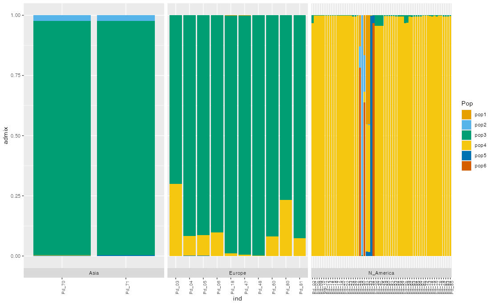

# Final Project

## Part 1: Short Assignment 2

------------------------------------------------------------------------

## Introduction

### Dataset

I will be working on the same vcf dataset that I am using for my current Master's thesis project looking at *Pseudogymnoascus destructans* individuals, the organism responsible for White Nose Syndrome in bats. This data was compiled from the NCBI database for *P. destructans* whole genome sequence samples. I have already processed the dataset into a vcf with 74 *P. destructans* individuals.

### Project Goals

The goal of this project is to look at and analyze the population structure of *P. destructans.* Looking at population structure will help me figure out the presence of any distinct subpopulations within my data. This will be very helpful for my Master's project which focuses on the genetic differences between *P. destructans* individuals and gene flow.

Here, I will analyze population structure using PCAngsd.

------------------------------------------------------------------------

## Population structure analysis

To look at population structure, I'll be using PCAngsd version 1.0 and generating a graph of the population structure it calculates.

### Running Plink

In order for PCAngsd to run, we need to use Plink to generate some output. Here, I used Plink version 1.90.beta.4.4 (mainly because that was the most recent version that worked for me that was already installed on the cluster). The full Plink script can be found [here,](code/scripts/01_plink-vcf.sh) but these are the options I specified for my script:

```{bash}
$PLDIR/plink --vcf $INDIR/pd.vcf.gz \
--make-bed \
--double-id \
--allow-extra-chr \
--maf 0.05 \
--geno 0.1 \
--mind 0.5 \
--out plink_pd
```

The `--make-bed` and `--out` arguments are needed in order to get the proper output plink files needed for PCAngsd

The `--maf`, `--geno`, and `--mind` options all help with filtering out any variants that don't meet specific thresholds:

-   `--maf` specifies the minor allele frequency threshold for variants
-   `--geno` specifies the missing call frequencies threshold for variants
-   `--mind` specifies the missing call frequencies threshold for samples

### Running PCAngsd

After running Plink, we can now use the output files to run PCAngsd (full script found [here](code/scripts/02_pcangsd.sh)). We will be using the `-admix` option to calculate population structure and generate our visual output.

```{bash}
$PCANGSD -plink $INDIR/plink_pd \
-admix \
-out pcangsd_pd
```

### Looking at PCAngsd output

#### Generating the dataframe

To look at PCAngsd output, I used the R library ***reticulate*** and imported python's ***numpy*** in order to properly read the `admix.[pop_number].Q.npy` file into R for analysis.

```{r}
#install.packages("reticulate")
library("reticulate")
# to help read .npy file
# good for combining python with R
np <- import("numpy")
# load in numpy
library(readr)
library(tidyverse)

setwd("path/to/working/directory")

## loading it in
admix <- np$load(file = "file_name.admix.[pop_number].Q.npy",allow_pickle=FALSE)
k <- your pop number here
# set k equal to the population number that PCAngsd calculates for you. The pop number will be in the admix file name.
admix= as.data.frame(admix)

head(admix)
# shows the first few lines of the admix dataframe
```

After loading in the admix data frame, I created a for loop to match the admix calculations to their proper population group

```{r}
pops <- c()
for (n in 1:k) {
    pops <- c(pops, paste0("pop", n))
}
colnames(admix) <- pops
```

Then I read in a text file that had a list of all my individual sample's names and a .csv file of their location data. I then added in certain columns from these files into the admix dataframe.

```{r}
indivs <- read.csv("ind_ids.txt")
pd_locations <- read.csv("pd_locations.csv")

rownames(admix) = indivs$individuals
admix$ind = indivs$individuals
admix$continent = pd_locations$continent
admix$country = pd_locations$country
admix$state = pd_locations$state
```

I then pivoted the dataframe to work with tidy data, and wrote it to a .csv to work with.

```{r}
#Pivot to long format
df_long = pivot_longer(admix,1:k,names_to="Pop",values_to="admix")

#write to .csv
write.csv(df_long,file="pd_pcangsd_longdf.csv",row.names=FALSE,quote=FALSE)
```

Full R script can be found [here](code/R_code/02_pcangsd_dataframe.R).

#### Generating the graph

```{r}
library(ggplot2)
library(see)
# for graph colors
library(dplyr)
# not particularly necessary, but helpful for rearranging data if needed

setwd("path/to/working/directory")
df_long <- read.csv("pd_pcangsd_longdf.csv")

# Making the graph:
# Population admixture per individual
ggplot(df_long,aes(x=ind,y=admix,fill=Pop)) +
scale_fill_okabeito(
  palette = "full",
  reverse = FALSE,
  order = 1:6,
    # will need to change based on population number
    # 1:[pop_number],
  aesthetics = "fill",
  ) +
theme(axis.text.x = element_text(angle = 90, hjust = 1, size = 8)) +
geom_col(col=NA,inherit.aes = TRUE)
```

{width="505"}

The full R script also has some other graphs I generated for my Master's project. Full R script can be found [here](code/R_code/03_pcangsd_graph.R). Other graphs can be found [here](/figures/01_all-samples/).

------------------------------------------------------------------------

## PCAngsd Results

Playing around with the PCAngsd graphs and grouping them by continent, you can see, while there aren't nearly as many samples from Asia and Europe, their individuals mainly consist of subpopulation 3 (green), while most of the North American samples are part of subpopulation 4 (yellow). The European individuals also have a bit of subpopulaiton 4, while the Asian individuals do not. This provides evidence to the theory that *P. destructans* was brought over to North America from Europe rather than Asia.

{width="903"}

There is also a small portion of individuals from North America (samples 29-34) whose admixtures look a bit different from the rest. As I was going back and collecting more metadata for my samples, I realized that these individuals are not actually *P. destructrans,* but rather some close relatives within the *Pseudogymnoascus* genus. This would explain why their structure is very funky, and it may have messed up the admixture results a bit, since they are different species.

------------------------------------------------------------------------

## Future analyses

1.  For my Master's project, I am currently trying to generate some phylogenetic trees using iqtree3. Hopefully, I should be able to generate some phylogenies and try to see if I can see any geographic patterns based on what iqtree produces.
2.  I can probably try running PCAngsd again, this time excluding the non *P. destructans* samples, and maybe also excluding the Asian and European samples, to see if there are any different population structure results.
3.  Eventual goal is to run FEEMS or Aligatr for landscape genomics analysis, but I am unsure if that is doable before the end of the semester.