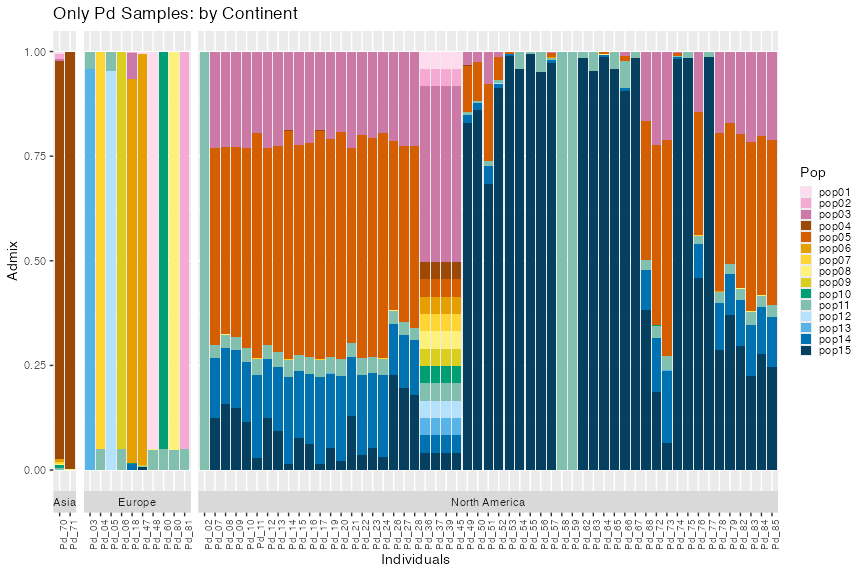
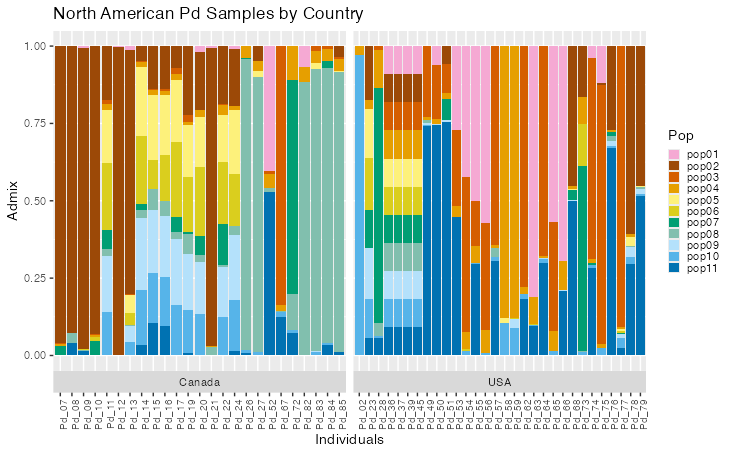

# Final Project

\<-- [See Part 1](Part1_Short_assign2.md)

## Part 2: Finishing the Project

------------------------------------------------------------------------

## Rerunning PCAngsd

I ran PCAngsd again, this time:

1.  only using Pd samples and
2.  only using North American Pd samples

To do this, I had to backtrack to the original vcf and exclude certain samples. I did this using:

`bcftools view -S <sample_file.txt>`

I then filtered it out a bit further this time around before using plink with bcftools. I had been using bcftools version 1.20, but this version does not seem to allow me to specify both `QUAL>20` and `MAF>0.05` at the same time. So I chose to use bcftools version 1.9, instead, since that was the second most recent version on the cluster.

```{bash}
bcftools view -S $SAMPLES \
-i 'QUAL>20' \
-i 'MAF>0.05' \
-v snps \
-m2 \
-M2 \
-Oz \
-o $OUTDIR/$OUTNAME \
$VCF
```

Full script can be found [here](/code/scripts/03_bcfview.sh)

Afterwards, I reran Plink on the 2 new vcfs. This time around I used **Plink 2.0** instead of version 1.90.beta.4.4, because I was able to download the newer version of the software onto the cluster. Then I reran PCAngsd for both and processed them through R to make graphs (using similar code as before). These new R scripts can be found in the [R_code](/code/R_code/) folder.

For generating the dataset to work with, the only major difference that was made was adjusting the population *for loop* to add padding to numbers less than two digits since the k's are larger now. I mainly did this so they would properly appear numerically later on in the graphs.

```{r}
pops <- c()
for (n in 1:k) {
    pops <- c(pops, paste0("pop", sprintf("%02d", n)))
}
## changed paste0("pop", n)
## to ---> paste0("pop", sprintf("%02d", n))
```

For making the PCAngsd graphs, I had to change up the color palette a bit because the original Okabe-Ito palette I had been working with did not have enough colors. I tried swapping to Viridis at first, but it was a bit difficult to distinguish some of the populations from each other. So instead, I built off of the Okabe-Ito color palette and added some lighter/darker versions of the already present colors, and messed around with the order a bit. The colors I ended up settling on can be seen in the graphs below, and the color codes that go along with them can be found at the top of [this script here.](/code/R_code/06_pcangsd_only-pd_graphs.R)

------------------------------------------------------------------------

## Results

### Only Pd Samples



Some things to note about this graph:

-   PCAngsd output the maximum k value, so it's possible not all of these subpopulations are actually subpopulations

    -   A lot of the North American samples have both populations 03, 05, 14, and 15

-   There are 4 samples from North America that look identical: Pd_36, 37, 39, and 45

    -   These individuals are all from New York from 2009, and are all cultures of the original Feb 2008 Williams Hotel 20631-21 type strain, which explains why they look identical

    -   The actual sample they appear to be based off of (Pd_28) does not seem to share the same admixture as them for some reason

-   Asside from these odd cultured strains, none of the North American samples appear to share the same population structure as the Asian samples (mostly pop04), but do share some similarities with the European samples, supporting the European Origin theory

    -   Subpopulations 03 and 11 are present in some European samples and most American samples

### Only North American Pd Samples



-   Once again you can see here that Pd_36, 37, 39, and 45 stand out and all look identical

    -   because of this I ended up running pcangsd one more time excluding those samples

-   The Canada samples seem to have a slightly different population structure compared to the USA samples

------------------------------------------------------------------------

## Second Round of Results

### North American Pd Samples without the identical-looking cultures


-   Now you can really see the difference between Canada and the USA samples

    -   Canada has more of pops 5-7, while the USA has more of pops 1-4


-   Separating by year as well seems to show a bit of a pattern as well

    -   many of the older samples were mainly pops 1-3, then in 2012 transitioned to more of 5-7, then in 2015-16 saw the larger introduction of pop 4

    -   These patterns might also be due to sample collection bias based on the timing and place that they were sampled, seeing that there were a lot of USA samples collected in 2008 - 2010, and Canada samples being collected more later

------------------------------------------------------------------------

## Discussion

Based on the PCAngsd data, it looks like there does appear to be some patterns based on location and year. This would make sense in terms of evolution in relation to time and dispersal. These patterns were seen most clearly in the last PCAngst I ran that only looked at the North American Pd samples, minus those four individuals that appeared to be identical cultures of each other and had some weird admixture stuff going on. Additionally, support for the European Origin hypothesis is also supported in this run of PCAngsd only looking at the Pd data. The European samples had two subpopulations, pop 3 and 11, that were also present in many of the North American samples, while none of the Asian subpopulations were not seen in the North American samples (not including the 4 odd cultured samples).

------------------------------------------------------------------------

## Broader Analysis: Next Steps

1.  I was not able to run TESS or Aligatr in time for this project's deadline, but those are my next steps for my Master's Thesis project. They hopefully will not take long, and from there, I can get a better sense of any geographical patterns that are present.
2.  Finish running iqtree analysis and generate some phylogenetic trees for my samples