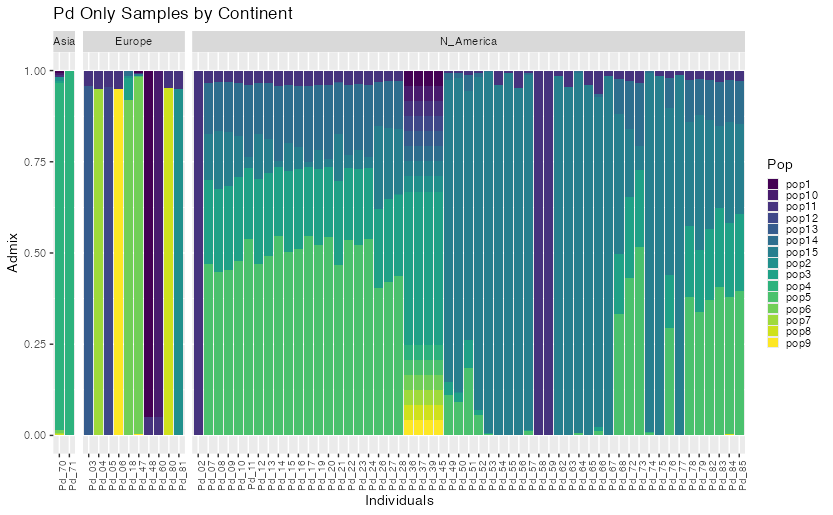
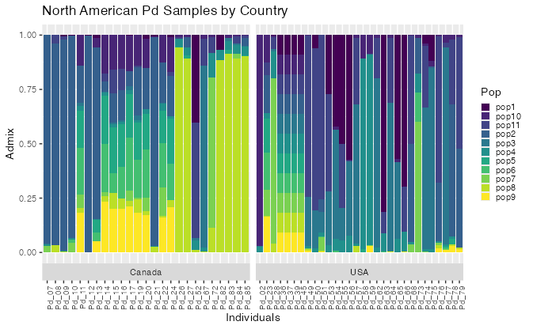

# Final Project

\<-- [See Part 1](Part1_Short_assign2.md)

## Part 2: Finishing the Project

------------------------------------------------------------------------

## Rerunning PCAngsd

I ran PCAngsd again, this time:

1.  only using Pd samples and
2.  only using North American Pd samples

To do this, I had to backtrack to the original vcf and exclude certain samples. I did this using:

`bcftools view -S <sample_file.txt>`

I then filtered it out a bit further this time around before using plink with bcftools. I had been using bcftools version 1.20, but this version does not seem to allow me to specify both `QUAL>20` and `MAF>0.05` at the same time. So I chose to use bcftools version 1.9, instead, since that was the second most recent version on the cluster.

```{bash}
bcftools view -S $SAMPLES \
-i 'QUAL>20' \
-i 'MAF>0.05' \
-v snps \
-m2 \
-M2 \
-Oz \
-o $OUTDIR/$OUTNAME \
$VCF
```

Full script can be found [here](/code/scripts/03_bcfview.sh)

Afterwards, I reran Plink on the 2 new vcfs. This time around I used **Plink 2.0** instead of version 1.90.beta.4.4, because I was able to download the newer version of the software onto the cluster. Then I reran PCAngsd for both and processed them through R to make graphs (using similar code as before). These new R scripts can be found in the [R_code](/code/R_code/) folder.

------------------------------------------------------------------------

## Results

### Only Pd Samples



### Only North American Pd Samples



------------------------------------------------------------------------

## Discussion

------------------------------------------------------------------------

## Broader Analysis